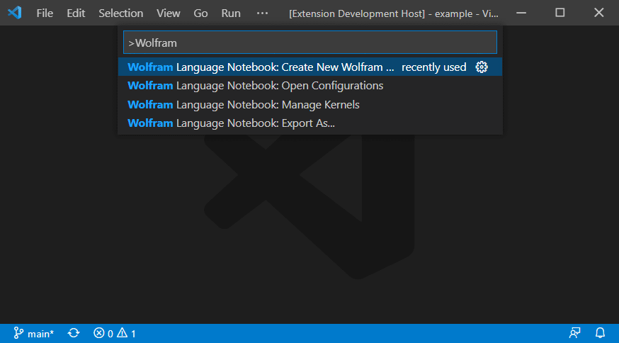

# Notebook support for Wolfram Language in VS Code

## Prerequisites

- `wolframscript`, shipped with [Wolfram Mathematica](https://www.wolfram.com/mathematica/) / [Wolfram Engine](https://www.wolfram.com/engine/) 12.0 or higher;
- OpenSSH (optional), for remote kernel support.

Install this extension from [VS Code Marketplace](https://marketplace.visualstudio.com/items?itemName=njpipeorgan.wolfram-language-notebook).

## Getting Started

To create a new Wolfram Language notebook, execute **Create New Wolfram Language Notebook** in the Command Palette, or create a new file with `.wlnb` extension. 

Execute **Manage Kernels** command and choose **Use wolframscript** to add `wolframscript` to the kernel configuration and connect to it. The status of the kernel will be shown in the status bar. 

Add a code cell, type Wolfram language code  in the cell, and evaluate it. 

## Features

**Syntax Highlighting**: The notebook highlights Wolfram language syntax, common built-in functions, and full character names, e.g. `\[Alpha]`.

**Auto-completion and Usages**: Auto-completion for built-in functions are provided. Their usage information is displayed when typing and hovering.

**Output Renderer**: The notebook renders common Wolfram language expressions into HTML for better presentations. Graphics are shown as rasterized images.

**Export as Wolfram notebook**: The notebooks can be exported as Wolfram notebooks, containing markdown cells, code cells and their outputs.

**Remote kernel**: When configured, the notebook can establish an ssh connection to the remote machine and launch a kernel on it. Computations are done remotely, but code and outputs are stored locally.

## Kernel Configuration

To add a new kernel, click **⨉ Wolfram Kernel** in the status bar and choose **Add a new kernel** (when no kernel is currently connected). By default, the command launching the kernels is `wolframscript` and the port is randomly selected between 49152 and 65535. For remote kernels, you may choose the private key file for ssh authentication, or skip this step if it is already available to `ssh`.

To edit or remove kernel configurations, find `kernel.configurations` in the extension settings page, and edit settings.json. Each kernel is an entry with the kernel name as the key and the following configurations as the value: 

| Key               | Value                                              |
|-------------------|----------------------------------------------------|
| type              | "local"/"remote"                                   |
| command           | command to launch the kernel, e.g. "wolframscript" |
| ports             | ranges of numbers, e.g. "1,3,6-9"                  |
| sshCommand        | the ssh command, e.g. "ssh"                        |
| sshHost           | user@hostname                                      |
| sshCredentialType | "key"/"none"                                       |
| sshCredential     | path to the ssh credential                         |

## Release Notes

Check [Release Notes](https://github.com/njpipeorgan/wolfram-language-notebook/wiki/Release-Notes).

## FAQ

**The notebook failed to connect to a kernel.**

  - Check that `wolframscript` is installed, and it can be used in the terminal.
  - Wolfram Mathematica/Engine limits the number of kernels running simultaneously. Try [closing all Wolfram processes](https://support.wolfram.com/36360) before connecting to a kernel fron the notebook.
  - [Open an issue](https://github.com/njpipeorgan/wolfram-language-notebook/issues) if the problem persists.

**The output of an evaluation was not what I expected.**

  - Please [open an issue](https://github.com/njpipeorgan/wolfram-language-notebook/issues) with the actual and expected output. Note that the extension only support a limited number of styling options for now. 
